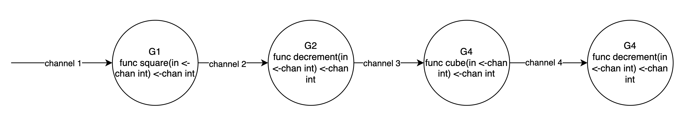
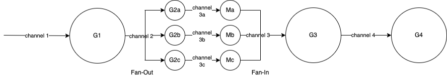
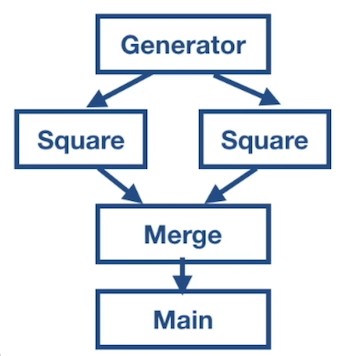
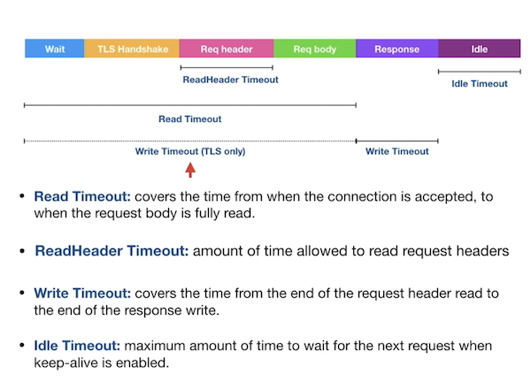

# Go concurrency exercises

<!-- `make toc` to generate https://github.com/jonschlinkert/markdown-toc#cli -->

<!-- toc -->

- [OS Threads and Goroutines](#os-threads-and-goroutines)
- [Channels](#channels)
- [Select](#select)
- [Sync Package](#sync-package)
  * [Mutex](#mutex)
  * [Atomic](#atomic)
  * [Cond](#cond)
  * [Once](#once)
  * [Pool](#pool)
- [Go Race Dectector](#go-race-dectector)
- [Concurrency Patterns](#concurrency-patterns)
  * [Pipeline](#pipeline)
  * [Fan-out, Fan-in](#fan-out-fan-in)
  * [Cancellation of Goroutines](#cancellation-of-goroutines)
- [Context Package](#context-package)
  * [Cancellation Functions](#cancellation-functions)
  * [Data Functions](#data-functions)
  * [Context Package Idioms](#context-package-idioms)
  * [HTTP Server Timeouts with Context](#http-server-timeouts-with-context)
- [Code Examples](#code-examples)
  * [Goroutines](#goroutines)
    + [Basic starting of goroutines](#basic-starting-of-goroutines)
    + [Server with multiple concurrent client connections](#server-with-multiple-concurrent-client-connections)
    + [Using a WaitGroup to block until goroutine done](#using-a-waitgroup-to-block-until-goroutine-done)
    + [Closures copy variables to goroutine so they persist even after function ends](#closures-copy-variables-to-goroutine-so-they-persist-even-after-function-ends)
    + [Pass variable to goroutine so it operates on the current value](#pass-variable-to-goroutine-so-it-operates-on-the-current-value)
  * [Channels](#channels-1)
    + [goroutine gives main routine data on a channel](#goroutine-gives-main-routine-data-on-a-channel)
    + [Iterate over unbuffered channel](#iterate-over-unbuffered-channel)
    + [Range over buffered channel](#range-over-buffered-channel)
    + [Send-only and receive-only channel directions](#send-only-and-receive-only-channel-directions)
    + [Channel owner creates, writes to and closes channel. Consumers should only read from the channel](#channel-owner-creates-writes-to-and-closes-channel-consumers-should-only-read-from-the-channel)
  * [Select](#select-1)
    + [Select statement waiting for channels](#select-statement-waiting-for-channels)
    + [time.After in a select for a timeout](#timeafter-in-a-select-for-a-timeout)
    + [default case in select makes it non-blocking](#default-case-in-select-makes-it-non-blocking)
  * [Sync Package](#sync-package-1)
    + [Using sync.Mutex.Lock and Unlock to guard shared resources accessed by multiple goroutines](#using-syncmutexlock-and-unlock-to-guard-shared-resources-accessed-by-multiple-goroutines)
    + [Using atomic.Add to update a variable with concurrent-safety](#using-atomicadd-to-update-a-variable-with-concurrent-safety)
    + [sync.Cond to make goroutine Wait until a condition met, whereupon Signal woke it up](#synccond-to-make-goroutine-wait-until-a-condition-met-whereupon-signal-woke-it-up)
    + [sync.Broadcast to wake up all Waiting goroutines](#syncbroadcast-to-wake-up-all-waiting-goroutines)
    + [sync.Once to call function once only, even across goroutines](#synconce-to-call-function-once-only-even-across-goroutines)
    + [Using a sync.Pool of resources](#using-a-syncpool-of-resources)
  * [Race Detection](#race-detection)
  * [Concurrent Web Crawler](#concurrent-web-crawler)
  * [Concurrency Patterns](#concurrency-patterns-1)
    + [Pipeline concurrency pattern](#pipeline-concurrency-pattern)
    + [Fanin Fanout](#fanin-fanout)
    + [Use done channel to cancel goroutines](#use-done-channel-to-cancel-goroutines)
  * [Image Processing Pipeline](#image-processing-pipeline)
  * [Context Package](#context-package-1)
    + [Create cancellable context](#create-cancellable-context)
    + [Create context with deadline](#create-context-with-deadline)
    + [Create context with timeout to limit time spent waiting for server response](#create-context-with-timeout-to-limit-time-spent-waiting-for-server-response)
    + [Associate context with a value](#associate-context-with-a-value)
  * [HTTP Server Timeouts](#http-server-timeouts)
  * [Own Exercises](#own-exercises)

<!-- tocstop -->

Exercises and code walks included in this repository are part of Udemy course "concurrency in Go (Golang)".

My changes start at commit 35 https://github.com/petherin/go-concurrency-exercises/commit/dba9ef06ecf604a01481b7b771258f3e0795a56a.

https://www.udemy.com/course/concurrency-in-go-golang/?referralCode=5AE5A041D5793C048954

## OS Threads and Goroutines
Goroutines run sequentially in OS threads.

Go will run as many OS threads as there are CPU cores on your machine. `runtime.GOMAXPROCS()` provides this number.

Parallelism is achieved by running goroutines sequentially on multiple os threads.

Each goroutine is given a time slice of 10ms.

## Channels

Default value for channel is `nil`. Reading/writing to a nil channel blocks forever. Create channels with `make` built-in function.

Closing a nil channel panics.

Owner of channel is a goroutine that instantiates, writes and closes a channel.

Channel users should only have a read view into the channel.

## Select

All `select` cases are considered simultaneously.

`select` waits until a case is ready to proceed.

If waiting for multiple channels in a `select` and more than one is ready, one will be picked at random.

`select`s useful for timeouts so long-running channels don't hold things up.

A `select` can be non-blocking if there's a `default` case. If a channel isn't ready in the `select` then a `default` case will exit the block without blocking.

Empty `select` blocks forever.

A nil channel in a `select` also blocks forever.

## Sync Package

### Mutex

`Lock` and `Unlock` resources you want to be concurrent-safe.

To allow multiple reads, but with writes that hold a lock exclusively, use `RLock` and `RUnlock`.

### Atomic

Atomic package can update variables in a concurrent-safe way.

### Cond

Orchestrates goroutines that are waiting for a condition to be true.

`Wait` will suspend goroutine execution until a condition is met. You won't be able to stop on a breakpoint on a `Wait()` line because the entire goroutine is suspended, as opposed to simply blocking at that line.

`Signal` wakes one goroutine waiting on the `cond` variable.

`Broadcast` wakes all goroutiones waiting on the `cond` variable.

### Once

`sync.Once` ensures only one call to `Do(funcValue)` ever calls the passed function, even on different goroutines.

This is good for things like Singletons, or resources that multiple goroutines need but that only need to be initialised once.

### Pool

Used to constrain the creation of expensive resources like db connections, network connections, and memory.

Maintains a pool of a fixed number of resources that can be reused.

Code `Get`s resource from the pool and when finished, `Put`s it back in the pool for other code to use.

## Go Race Dectector

Race detector find race conditions in Go code.

`go test -race mypkg`

`go run -race mysrc.go`

`go build -race mycmd`. If you then execute the resulting build e.g. `./mycmd` any data races will be shown.

`go install -race mypkg`

Binary needs to be race-enabled so race detector can work on it.

Race-enabled binaries can be 10 times slower and use 10 times more memory, so don't release to production, use during testing phase.

## Concurrency Patterns
### Pipeline

Used to process streams or batches of data. It's a series of stages connected by channels.

Each stage is represented by a goroutine.

Goroutines can have the same input and output parameters, meaning we can chain them together however we want.

For example, we could do `square(decrement(square(ch)))`.

Separating stages out provides us with good separation of concerns.

If a stage is taking a long time we can increase the number of goroutines for that stage.

### Fan-out, Fan-in

If we have a stage in our pipeline that is taking too long and blocking subsequent stages, we can use fan-out, fan-in.

Multiple goroutines for a stage are started. They take in items from the incoming channel and do work. This is fan-out.

They send the output on their own channels to `merge` goroutines. These merge the incoming multiple channels into a single output channel. This is fan-in.

### Cancellation of Goroutines

In the above pipeline, `main()` is waiting for values on the channel from `merge()`.

If there are multiple values on the channel from `merge()` but `main()` only reads one, it will block execution.

`merge()` goroutines will be blocked when trying to send more values.

`square()` and `generator()` will also be blocked on sending because `merge()` is blocked.

This is a goroutine leak.

We need a way to cancel goroutines if something goes wrong like this.

We can pass a read-only `done` channel to goroutines.

Then we can close the channel to send broadcast signal to all goroutines.

On receiving the signal on `done` channel, goroutines need to abandon work and terminate.

## Context Package

Serves two primary purposes.

* Provides API's for cancelling branches of the call graph (i.e. the calls made during a given request).
* Provides a data bag for transporting request-scoped data through the call graph.

### Cancellation Functions

`context.Background()` returns an empty context, it's the root of any context tree.

`context.TODO()` returns an empty context, intended to be a placeholder.

`ctx, cancel := context.WithCancel(context.Background())` returns a copy of parent context with a new Done channel. The returned `cancel` allows us to close the context's Done channel.

`cancel()` doesn't wait for anything, it just closes the Done channel and returns. It can be called by many goroutines simultaneously, but after the first call, it doesn't do anything.

`context.WithDeadline()` takes parent context and a time as input. It returns a new context that closes its Done channel when the machine's clock advances past the deadline.

`ctx.Deadline()` tells us if a deadline is associated with the context.

`context.WithTimeout()` takes parent context and a time duration as input. It returns a new context that closes its Done channel when the given duration expires.

`WithTimeout` is actually a wrapper around `WithDeadline`. What's the difference? 

`WithTimeout()`'s timer countdown begins from the moment the context is created.

`WithDeadine` sets an explicit time when timer will expire.

### Data Functions

`context.WithValue()` associates request-scoped values with a context.

`ctx.Value()` returns the value associated with the provided key.

### Context Package Idioms

**Incoming requests to a server should create a context as early as possible.** `http.Request` already contains a context. Use `ctx` for the variable name.

**Outgoing calls to servers should accept a context.** Higher level calls need to tell lower level calls how long they are willing to wait.

**Pass a context to functions performing I/O.** Functions doing I/O should accept context as first parameter and respect timeouts and deadlines configured by the caller.

**Any change to a context value creates a new context value that should be used going forward.**

**When a context is cancelled, all context derived from it are also cancelled.**

**Use TODO context only if we are unsure which context to use.** This can happen when a function is not responsible for creating the top level context. Or we haven't figured out where the actual context will come from.

**Use context values only for request-scoped data.** Do not use context values to pass optional parameters to functions, which then become essential for its execution. A function should be able to work even with an empty context value.

### HTTP Server Timeouts with Context

These protect against DDOS attacks.

There are four main timeouts in `net/http.Server`.

* Read timeout
* Read header timeout
* Write timeout
* Idle timeout

Timeouts apply at network connection level only. HTTP handlers don't use them so they can run for a long time if not controlled.

`net/http` has a TimeOutHandler to timeout HTTP handlers. If handler runs longer than this time limit, it returns a 503 Service Unavailable error and the configured HTML error message to the client.

## Code Examples

### Goroutines
#### [Basic starting of goroutines](https://github.com/petherin/go-concurrency-exercises/commit/dba9ef06ecf604a01481b7b771258f3e0795a56a)

#### [Server with multiple concurrent client connections](https://github.com/petherin/go-concurrency-exercises/commit/49dc2c5a2eed96247a78136bce78cb7ced9c135b)

#### [Using a WaitGroup to block until goroutine done](https://github.com/petherin/go-concurrency-exercises/commit/731e894ce5db6384a265be605a50ea4dc355a0b2)

#### [Closures copy variables to goroutine so they persist even after function ends](https://github.com/petherin/go-concurrency-exercises/commit/e2aab16ab7e1c6d8991c3c85f636054281685c46)

#### [Pass variable to goroutine so it operates on the current value](https://github.com/petherin/go-concurrency-exercises/commit/f39439f8a22957cae497f9610c3fdb18eff457c9)

### Channels
#### [goroutine gives main routine data on a channel](https://github.com/petherin/go-concurrency-exercises/commit/792223586e416af6f2b5405f965d4a74f437aa9f)

#### [Iterate over unbuffered channel](https://github.com/petherin/go-concurrency-exercises/commit/19fa7ac6e5a79b9cc6590cf54f3c90e6b9b700c8)

#### [Range over buffered channel](https://github.com/petherin/go-concurrency-exercises/commit/b759a51603d4a72cf7314b435e7d9eaba9da6a50)

#### [Send-only and receive-only channel directions](https://github.com/petherin/go-concurrency-exercises/commit/143bb7f67646e11020ab91ced5e8bc680f131352)

#### [Channel owner creates, writes to and closes channel. Consumers should only read from the channel](https://github.com/petherin/go-concurrency-exercises/commit/5f1156c664b2c553b7909406a020e4e24378112f)

### Select
#### [Select statement waiting for channels](https://github.com/petherin/go-concurrency-exercises/commit/405ce475e322ba516a6d621eb49dc10141575f2e)

#### [time.After in a select for a timeout](https://github.com/petherin/go-concurrency-exercises/commit/9cf6c4c1c2cd2eab6446b7ee2bc3c462ad16c889)

#### [default case in select makes it non-blocking](https://github.com/petherin/go-concurrency-exercises/commit/f5bcb00fc10951ff5a1f44d3d52cb06b3e675474)

### Sync Package
#### [Using sync.Mutex.Lock and Unlock to guard shared resources accessed by multiple goroutines](https://github.com/petherin/go-concurrency-exercises/commit/8209c3150fdb275a6d5517bc826ef0f3ebcdcc2e)

#### [Using atomic.Add to update a variable with concurrent-safety](https://github.com/petherin/go-concurrency-exercises/commit/2bda27dae88d7c84ff096bc750f4faf9e35b6af1)

#### [sync.Cond to make goroutine Wait until a condition met, whereupon Signal woke it up](https://github.com/petherin/go-concurrency-exercises/commit/691737baca93446c7c96e1901ef8abb375fff335)

#### [sync.Broadcast to wake up all Waiting goroutines](https://github.com/petherin/go-concurrency-exercises/commit/342da5580d08d84da110ba044cfd2b712e7ef293)

#### [sync.Once to call function once only, even across goroutines](https://github.com/petherin/go-concurrency-exercises/commit/fb91dce525e2219f7de241ed42f79bf839184006)

#### [Using a sync.Pool of resources](https://github.com/petherin/go-concurrency-exercises/commit/77af390ea04bf5d2ed074f1c9e015bc4a6fdc6e6)

### [Race Detection](https://github.com/petherin/go-concurrency-exercises/commit/0b1a83299d00f4be5ea9ff2dcb4eaf42567c8f9a)

### [Concurrent Web Crawler](https://github.com/petherin/go-concurrency-exercises/commit/c3e95ec54e53265eccebc9dcbf4c4c5778e8f5a1)

### Concurrency Patterns
#### [Pipeline concurrency pattern](https://github.com/petherin/go-concurrency-exercises/commit/26b75cb7163a8adec494e4b02acad6b545096869)

#### [Fanin Fanout](https://github.com/petherin/go-concurrency-exercises/commit/b1d575aa06d99dab1f2f885a85b21184d4416782)

#### [Use done channel to cancel goroutines](https://github.com/petherin/go-concurrency-exercises/commit/cb512c9c667b98ec786b706c4c1045b079b486c8)

### [Image Processing Pipeline](https://github.com/petherin/go-concurrency-exercises/commit/e152f2282b595c74c1e5dc3080cdd83d60dac821)

### Context Package
#### [Create cancellable context](https://github.com/petherin/go-concurrency-exercises/commit/f673f6f3847c913c30e24ba6ad54363673aefc1c)

#### [Create context with deadline](https://github.com/petherin/go-concurrency-exercises/commit/2b767de12ebcdbc7fdade13a5646a3867b1a86e8)

#### [Create context with timeout to limit time spent waiting for server response](https://github.com/petherin/go-concurrency-exercises/commit/7b6ff358a057c6a8d07a504b2371f92fb07ba9d8)

#### [Associate context with a value](https://github.com/petherin/go-concurrency-exercises/commit/803e053aa68cbe72e182741103047b75cd8090d7)

### [HTTP Server Timeouts](https://github.com/petherin/go-concurrency-exercises/commit/4048ab52009ee996491651014e0d45c44850dd36)

### Own Exercises
[Basic pool of workers using WaitGroup to wait for them to finish](https://github.com/petherin/go-concurrency-exercises/blob/c9398d2ee3eb6243a25ef307936c1f14368127e2/cmd/cli/main.go)
